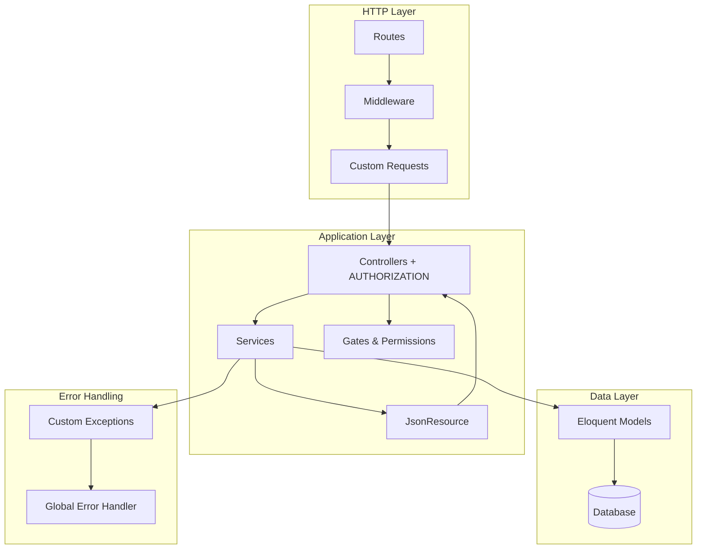
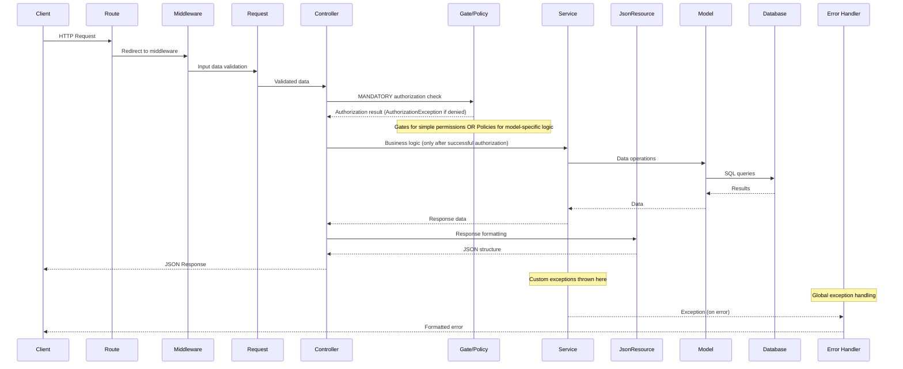

# Universal Laravel API Architecture Document

## Overview

This document describes universal architectural principles for Laravel API applications, focused on core Laravel components to create an easily maintainable codebase. The architecture can be applied to any domain and application type.

## Architecture Components

The application follows a simplified layered architecture with the following core components:



## Core Components

### 1. Custom Requests
Form Request classes handle **input data validation only**. Authorization is performed entirely in controllers through Gates to ensure a centralized and consistent approach.

**Form Request Principles:**
- Do not override the `authorize()` method - use default behavior (returns `true`)
- Contain only validation rules in the `rules()` method
- DO NOT perform authorization - all authorization is centralized in controllers
- Ensure data validation before passing to controller
- Automatically return validation errors in standard Laravel format

### 2. Controllers
Controllers handle HTTP requests, **perform ALL authorization through Gates**, and orchestrate application flow.

**Key Controller Principles:**
- **Authorization first**: Each method begins with `$this->authorize()` before any business logic
- **No try-catch blocks**: Use global exception handler for error handling
- **Dependency injection**: Services are injected through constructor
- **Owner-based authorization**: For update/delete operations, first get model, then pass it to `authorize()`
- **Orchestration**: Coordinate work between Form Requests, Services, and Resources
- **Consistency**: Unified authorization approach across all methods

**Execution flow in controller methods:**
1. Authorization through `$this->authorize()`
2. Get data from service
3. Return formatted response through JsonResource

### 3. JsonResource and ResourceCollection
JsonResource classes are responsible for formatting API responses and ensuring consistent data structure.

**JsonResource Functions:**
- **Uniform formatting**: Consistent JSON response structure for entire API
- **Conditional fields**: Support for `whenLoaded()`, `when()`, `whenNotNull()` for dynamic responses
- **Nested resources**: Automatic handling of related models
- **Data transformation**: Converting internal data to public API format
- **Automatic HTTP codes**: Proper response codes (200, 201) without additional configuration

**ResourceCollection Features:**
- **Metadata**: Automatic addition of pagination and total count information
- **Data wrapping**: Structure with `data` array and `meta` object
- **Bulk operations**: Efficient handling of object collections

### 4. Services
Services contain business logic and coordinate between different parts of the application.

**Service Responsibilities:**
- **Business logic**: All complex application logic centralized in services
- **Transactions**: Database transaction management to ensure integrity
- **Model operations**: Direct interaction with Eloquent models
- **Exceptions**: Throw custom exceptions on errors
- **Coordination**: Orchestration between different parts of the system
- **No authorization**: Assumes authorization has already been checked in controller

**Service Design Principles:**
- **One service per domain**: {Domain}Service, AuthService, etc.
- **Static injection**: Injected into controllers through constructor
- **Pure methods**: Accept data, return result or throw exception
- **Transaction safety**: Use DB transactions for complex operations

### 5. Custom Exceptions
Custom exceptions provide clear error handling and meaningful error messages.

**Types of Custom Exceptions:**
- **{Domain}NotFoundException**: For cases when requested resource is not found
- **{Domain}CreationException**: For errors when creating new records
- **{Domain}UpdateException**: For errors when updating data
- **BusinessLogicException**: For business rule violations

**Benefits of Custom Exceptions:**
- **Semantic clarity**: Clear understanding of error type
- **Centralized handling**: Automatic handling by global handler
- **Consistent messages**: Standardized error formats
- **Type safety**: Ability to catch specific error types

### 6. Gates and Permissions
**Centralized Authorization**: Laravel Gates - the single place for all authorization logic. Permissions are stored in the database and checked through Gates, which are called exclusively from controllers.

**Authorization Architecture:**
- **Gates as single source of truth**: All authorization logic defined in AuthServiceProvider
- **Permission-based system**: Permissions stored in DB and checked through `hasPermission()`
- **Owner-based authorization**: Combination of global permissions and resource owner checking
- **Granular control**: Separate permissions for each action (read, create, update, delete)

**Types of Gates:**
- **Simple Gates**: Check only user permission existence
- **Resource Gates**: Accept model to check resource owner
- **Admin Gates**: Special permissions for administrative functions

**Gate Operating Principles:**
- **Fallback logic**: "Global permission OR resource owner"
- **Nullable parameters**: Support for optional models for universality
- **Semantic naming**: Clear permission names ({domain}.read, {domain}.manage)

## Authorization Principles

### Why authorization only in controllers?

The **centralized authorization in controllers** approach was chosen for the following reasons:

1. **Single point of control**: All authorization decisions are made in one architecture layer
2. **Transparency**: Easy to see what permissions are required for each action
3. **Consistency**: Same `$this->authorize()` approach across all controllers
4. **Laravel nativeness**: Uses built-in Laravel capabilities without additional abstractions
5. **Debugging simplicity**: All authorization checks in predictable place
6. **Testability**: Easy to mock and test authorization in controller unit tests

### Authorization Rules

**MANDATORY Rules:**
1. Every controller method MUST begin with `$this->authorize()`
2. Authorization MUST be the first action before any business logic
3. FormRequests do NOT perform authorization (always `return true`)
4. Middleware does NOT perform business authorization (only authentication)
5. Services do NOT perform authorization (assumed to be already checked)

**Examples of correct authorization:**
- ✅ **CORRECT**: Authorization as first action in each controller method
- ✅ **CORRECT**: Owner-based authorization with model passed to `authorize()`
- ✅ **CORRECT**: Using semantic permission names (`{domain}.create`, `{domain}.update`)
- ❌ **INCORRECT**: Authorization after business logic (security vulnerability)
- ❌ **INCORRECT**: Missing authorization in controller methods
- ❌ **INCORRECT**: Authorization in Form Requests or Services

### Authorization Exceptions

On failed authorization, Laravel automatically throws the built-in `\Illuminate\Auth\Access\AuthorizationException` which:
1. Is automatically handled by global handler
2. Returns HTTP 403 status
3. Requires no try-catch in controllers
4. Ensures consistent authorization error responses
5. Is the standard Laravel way to handle authorization errors

## Authorization Patterns

### Gates - for simple permissions

**Pattern 1: Simple permission check**
Controller checks global permission:
- Authorization: `$this->authorize('{domain}.{action}')`
- Business logic: `$this->{domainService}->{methodName}()`  
- Response: `{DomainResource}::make($result)`

**Pattern 2: Owner-based authorization through Gates**
For operations with specific resources:
- Get model: `$model = $this->{domainService}->find{Domain}ById($id)`
- Authorization with model: `$this->authorize('{domain}.{action}', $model)`
- Standard operation and response

**Gates definition (AuthServiceProvider):**
- Simple Gate: check only user permission
- Resource Gate: "global permission OR resource owner" logic
- Nullable parameters for universality

### Policies - for complex model-specific logic

**Pattern 3: Complex authorization through Policy**
For cases with multiple conditions:
- Get model from service  
- Authorization: `$this->authorize('{action}', $model)`
- Laravel automatically finds {DomainPolicy}::{action}()

**Policy Structure:**
- Methods correspond to actions (update, delete, view, etc.)
- Contain complex model state logic
- Combine permission checking and business rules
- Return boolean result

### Mixed Approach - Gates + Policies

**Selection Recommendations:**
- **Gates** for administrative functions and simple permissions
- **Policies** for resource-specific logic and complex business rules
- **Unified interface**: everything through `$this->authorize()` in controllers
- Laravel automatically determines whether to use Gate or Policy

### Key Selection Principles

**Use Gates when:**
- Simple permission check from DB
- Global administrative functions
- Permissions not dependent on specific model
- Simple owner-based logic ("global permission OR resource owner")

**Use Policies when:**
- Complex authorization logic dependent on model state
- Multiple conditions for one action
- Contextual authorization (model status affects permissions)
- Need for inheritance and logic reuse between similar models

**In any case:**
- ALL authorization remains in controllers through `$this->authorize()`
- Laravel automatically determines whether to use Gate or Policy
- Same error handling through AuthorizationException
- Consistent structure and approach throughout application

## Request Flow



## Error Handling Strategy

All custom exceptions are handled centrally in the global exception handler.
**Important**: Controllers should NOT contain try-catch blocks, as all exceptions are automatically caught by the global handler.

**Global Exception Handler (Handler.php) handles:**
- **{Domain}NotFoundException**: Returns HTTP 404 with "Resource not found" message
- **AuthorizationException**: Built-in Laravel exception, returns HTTP 403 "Forbidden"
- **{Domain}CreationException**: Returns HTTP 422 with "Creation failed" message
- **ValidationException**: Standard Laravel validation errors, HTTP 422 with error details
- **Other exceptions**: Passed to parent handler for standard processing

### Benefits of Global Error Handling:

1. **Centralization**: All errors handled in one place
2. **Consistency**: Unified error response format for entire API
3. **Code cleanliness**: Controllers remain simple and focused on orchestration
4. **Testing ease**: No need to test error handling in each controller
5. **Scalability**: Easy to add new exception types

## Benefits of This Architecture

1. **Simplicity**: No over-engineering with unnecessary layers
2. **Laravel nativeness**: Efficiently uses built-in Laravel capabilities
3. **Validation**: Clear separation of validation logic in Request classes
4. **Centralized authorization**: ALL authorization in one place - controllers through Gates and Policies
5. **Authorization consistency**: Unified `$this->authorize()` approach across all controllers
6. **Business logic**: Centralized in Service classes
7. **Error handling**: Consistent custom exception handling without try-catch in controllers
8. **Response formatting**: Uniform JSON responses through JsonResource and ResourceCollection
9. **Maintainability**: Easy to understand and extend
10. **Testability**: Each component can be tested independently
11. **Security**: Cannot forget authorization, as it's always first in controller

## JsonResource - Best Practices

### Conditional Fields:
- **whenLoaded()**: Shows field only if relation is loaded through Eloquent `with()`
- **when()**: Conditional field inclusion based on logical checks
- **whenNotNull()**: Shows field only if value is not null
- **Administrative data**: Conditional fields for different user roles

### Nested Resources:
- **Collection resources**: Using `ResourceClass::collection()` for arrays of related objects
- **Single resources**: Wrapping related models in corresponding Resource classes
- **Lazy loading**: Preventing N+1 problems through `whenLoaded()`

## API Response Structure

The API follows standard Laravel conventions for response structure, ensuring consistency and predictability for clients.

### HTTP Status Codes

The API uses the following standard HTTP codes:

- **200 OK** - Successful execution of general operations (data retrieval, updates)
- **201 Created** - Successful creation of new record
- **204 No Content** - Successful record deletion (no data returned)
- **400 Bad Request** - Invalid request
- **401 Unauthorized** - Authentication required
- **403 Forbidden** - Access denied (authorization error)
- **404 Not Found** - Resource not found
- **422 Unprocessable Entity** - Validation errors
- **500 Internal Server Error** - Internal server error

### Successful Response Structure

#### 1. Simple Success Message
Used for operations that don't return data (e.g., successful deletion).

**Success Response Pattern:**
```json
{
    "message": "{Domain} {action} successfully"
}
```

#### 2. Single Object
Uses JsonResource for uniform formatting.

**Response Pattern:**
```json
{
    "data": {
        "id": 1,
        "field1": "value1",
        "field2": "value2",
        "created_at": "2025-09-08T10:30:00.000000Z",
        "updated_at": "2025-09-08T10:30:00.000000Z",
        "related_resource": {
            "id": 1,
            "name": "Related Name",
            "attribute": "related_value"
        }
    }
}
```

#### 3. Object Collection
Uses ResourceCollection for handling data arrays.

**Collection Pattern with Metadata:**
```json
{
    "data": [
        {
            "id": 1,
            "field1": "value1",
            "field2": "value2",
            "created_at": "2025-09-08T10:30:00.000000Z",
            "updated_at": "2025-09-08T10:30:00.000000Z"
        },
        {
            "id": 2,
            "field1": "another_value1",
            "field2": "another_value2",
            "created_at": "2025-09-08T11:15:00.000000Z",
            "updated_at": "2025-09-08T11:15:00.000000Z"
        }
    ],
    "meta": {
        "total": 2,
        "per_page": 15,
        "current_page": 1
    }
}
```

### Error Response Structure

#### 1. Validation Errors (HTTP 422)
Uses standard Laravel format for validation errors. Automatically handled by global handler through ValidationException from FormRequest.

**Validation Error Pattern:**
```json
{
    "message": "Validation failed",
    "errors": {
        "field1": [
            "The field1 field is required."
        ],
        "field2": [
            "The field2 has already been taken."
        ],
        "field3": [
            "The field3 must be a number.",
            "The field3 must be at least 0."
        ]
    }
}
```

#### 2. General Errors
Used for system errors, authorization errors, and custom exceptions.

**Error Patterns:**

Authorization Error (HTTP 403):
```json
{
    "message": "This action is unauthorized"
}
```

"Not Found" Error (HTTP 404):
```json
{
    "message": "{Domain} with ID {id} not found"
}
```

Creation Error (HTTP 422):
```json
{
    "message": "Failed to create {domain}: {specific_error}"
}
```

### Controller Implementation Principles

**Operations and HTTP Codes:**
- **Creation (store)**: Returns 201 Created automatically through JsonResource
- **List retrieval (index)**: Returns 200 OK by default
- **Single record retrieval (show)**: Returns 200 OK by default
- **Update (update)**: Returns 200 OK by default
- **Deletion (destroy)**: Returns 204 No Content with success message

**Method Action Sequence:**
1. **Authorization**: Permission check through `$this->authorize()`
2. **Data operations**: Call corresponding service methods
3. **Response formatting**: Use JsonResource or simple JSON response

**Owner-based Authorization Features:**
- For update/delete operations, first get the model
- Then pass model to `authorize()` for owner checking
- This ensures security even if model doesn't exist

### Global Error Handling

The global exception handler automatically formats errors into consistent format in `Handler.php`.

**Handled Exception Patterns:**
- **AuthenticationException**: HTTP 401 "Unauthenticated" - authentication required
- **AuthorizationException**: HTTP 403 "Forbidden" - access denied (from Gates)
- **ValidationException**: HTTP 422 "Validation failed" - validation errors with details
- **{Domain}NotFoundException**: HTTP 404 "Resource not found" - resource not found
- **{Domain}CreationException**: HTTP 422 "Creation failed" - creation error
- **Others**: Passed to parent handler

**Operating Principle:**
- Sequential exception type checking through `instanceof`
- Each type returns corresponding JSON with proper HTTP code
- Unhandled exceptions passed to parent handler

### Response Structure Principles

1. **Consistency**: All responses follow the same format
2. **Standardness**: Standard HTTP status codes are used
3. **Informativeness**: Errors contain clear messages
4. **Laravel-nativeness**: Follows Laravel standards without additional abstractions
5. **Automation**: JsonResource and global error handler automatically format responses

### JsonResource Integration

JsonResource automatically applies proper response structure:

- **Single resources**: Wrapped in `data` key
- **Collections**: Contain array in `data` and metadata in `meta`
- **HTTP codes**: Automatically set proper codes (201 for POST, 200 for GET/PUT)
- **Conditional fields**: Use `when`, `whenLoaded`, `whenNotNull` methods for dynamic responses

This structure ensures API uniformity and meets modern frontend application expectations.

## Future Considerations

This simplified architecture can be extended later when needed:

- Repository pattern can be added with significant project growth
- Event-driven architecture can be introduced for complex business processes
- Additional middleware layers for advanced request processing
- Caching strategies at service level
- Queue systems for background processing
- API versioning through JsonResource

## Authorization Summary

**IMPORTANT: Unified Authorization Approach**

This architecture ensures **100% authorization consistency** through the following principles:

### ✅ WHAT WE DO:
- **ALL authorization ONLY in controllers** through `$this->authorize()`
- **First action** in each controller method - authorization
- **Gates** contain all permission logic (including owner-based)
- **FormRequests** only for validation (don't override `authorize()`)
- **AuthorizationException** built-in Laravel exception automatically handled globally

### ❌ WHAT WE DON'T DO:
- Authorization in FormRequests (use default behavior)
- Authorization in middleware (only authentication)
- Authorization in services (assumed to be already checked)
- Mixed approaches (sometimes in controllers, sometimes in requests)
- Skip authorization in any controller methods

### 🎯 RESULT:
- **Predictability**: Always know where to look for authorization logic
- **Security**: Impossible to forget permission checks
- **Consistency**: Unified approach throughout application  
- **Simplicity**: One way to do authorization, not several
- **Testability**: Easy to test in isolation

---
*Universal Laravel API Architecture Document*  
*Version: Universal 1.0 - Centralized Authorization through Gates and Policies in Controllers*